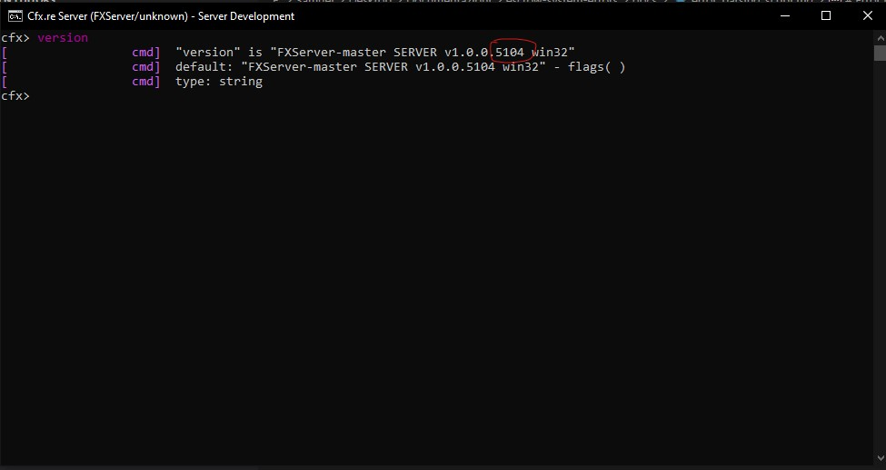

# Error parsing script ... <\1>

Error message **example**:
 
`Error parsing script @jobs_creator/server/markers/job_shop.lua in resource jobs_creator: @jobs_creator/server/markers/job_shop.lua:1: syntax error near '<\1>'`

## Possible reasons
* Your server version is too old, the **minimum** version is 4752

## How to verify my server version?
To verify what server version your server is currently using, you have to use the following command in your FiveM server console: `version`

### Example

## How to update my server version?
To update your server version, you have to download the new [server artifacts](https://runtime.fivem.net/artifacts/fivem/build_server_windows/master/) and to extract and replace them in your server folder

This is the **official** [FiveM guide](https://docs.fivem.net/docs/server-manual/setting-up-a-server/) to update your server

## My server version is already updated, but I have the error
If you have the error even if your server version is not the issue, then you have to check [here](failed_to_verify_protected_resource.md)