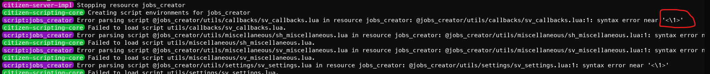
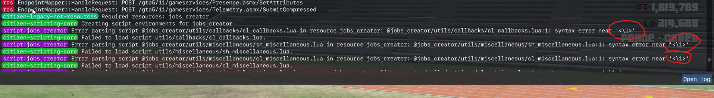
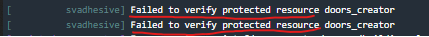

# Home

Here you will find the solutions to common errors when using mine scripts due FiveM Escrow system

To verify if your error is caused by the FiveM asset escrow, you can simply restart the script and check **both** in **F8 console** and in **server console** (txAdmin) for errors

## Examples of the errors caused by the FiveM Escrow system

## Solutions
If you can't start / use a script, here's a list of possible reasons/solutions:

* [**Minimum** server artifacts version 4752](error_parsing_script)
* OneSync has to be enabled
* [**Don't** use FileZilla](failed_to_verify_protected_resource)
* [Use the correct license key generated by the same account where you downloaded the script](wrong_license)

It's **strongly** suggested to read all the pages carefully, since these fixes are tested by many users and they are supposed to work, if none of the pages helps you to fix the errors, please read [here](nothing_works.md)

   
You can find all mine scripts [here](https://jaksam1074-fivem-scripts.tebex.io/)